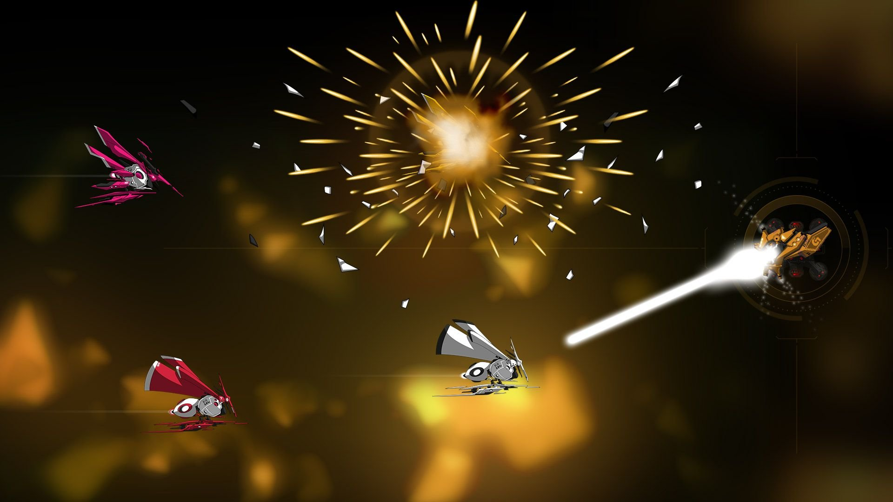

import Tabs from '@theme/Tabs';
import TabItem from '@theme/TabItem';
import { Vimeo } from 'mdx-embed';

# Onboarding

[Coding Games and Programming Challenges to Code Better](https://www.codingame.com/ide/puzzle/onboarding)




## Énoncé

Une mission tutoriel pour les nouveaux venus : votre programme doit trouver laquelle des deux cibles est la plus proche.

## Histoire

Défendez la planète des attaques de vaisseaux extra-terrestres, armé d'un canon-laser automatisé.

## Objectif

Votre programme doit détruire les vaisseaux ennemis en tirant sur l'ennemi le plus proche à chaque tour.

## Règles

Les vaisseaux ennemis approchent en ligne droite vers votre canon.
  
**À chaque début d'un tour de jeu** (dans la boucle _game loop_), vous obtenez les informations des deux ennemis les plus proches :
- variable `enemy1` : le nom de l'ennemi 1.
- variable `dist1` : la distance à laquelle se trouve l'ennemi 1.
- variable `enemy2` : le nom de l'ennemi 2.
- variable `dist2` : la distance à laquelle se trouve l'ennemi 2.

**Avant la fin du tour** (fin de la boucle), vous devez indiquer en sortie le nom de l'ennemi le plus proche. Pour afficher le nom de
l'ennemi le plus proche, vous devez utiliser la variable `enemy1` ou `enemy2`.

```javascript
// game loop
while (true) {
    var enemy1 = readline(); // name of enemy 1
    var dist1 = parseInt(readline()); // distance to enemy 1
    var enemy2 = readline(); // name of enemy 2
    var dist2 = parseInt(readline()); // distance to enemy 2

    // Write an action using console.log()

    // Enter the code here

    if (dist1 < dist2) {
        console.log(enemy1);
    } else {
        console.log(enemy2);
    }
}
```


<iframe width="100%" height="600px" src="https://www.codingame.com/replay/602048176"></iframe>